# 📘 E-Course App (Flutter)

A dynamic and fully featured **Learning Management App** built with **Flutter & Dart**, designed for both learners and educators. This app allows instructors to create and manage courses, while students can enroll, view lessons (video/text), track progress, and participate in quizzes — all via a sleek mobile interface. Built with clean architecture, modern state management and offline-ready capabilities, it aims to bring high-quality education to mobile devices.

---

## ✨ Key Features

- 🎓 **Role Based Access** – Supports separate flows for Students and Instructors.  
- 🗂 **Course Creation & Management** – Instructors can add/update courses, modules, upload videos and resources.  
- 📖 **Lesson Viewer** – Students can watch video lessons or read text content at their own pace.  
- 📊 **Progress Tracking** – Visual indicators of completed lessons, quiz scores and certificate readiness.  
- 🧪 **Quizzes & Assessments** – Built-in quizzes after modules to reinforce learning.  
- 📥 **Download / Offline Mode** – Users can save lessons for offline access (where configured).  
- 🎨 **Modern UI / Theme Support** – Material Design, dark & light themes, smooth animations.  
- 🔐 **Authentication & Backend Integration** – Using Firebase Auth / Firestore (or custom API) for secure user management and course data.  

---

## 🖼 Screenshots

  
  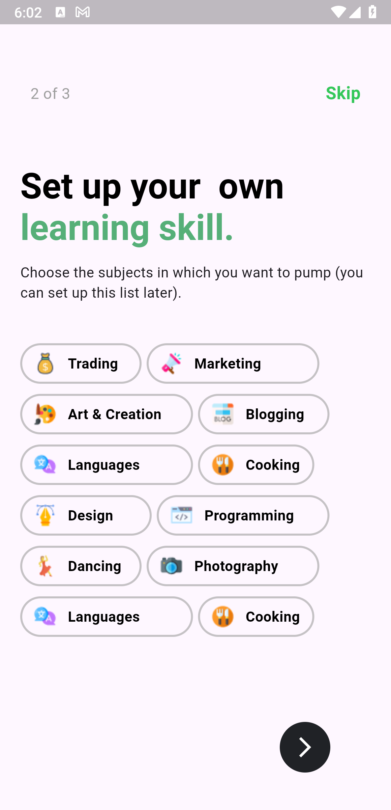
  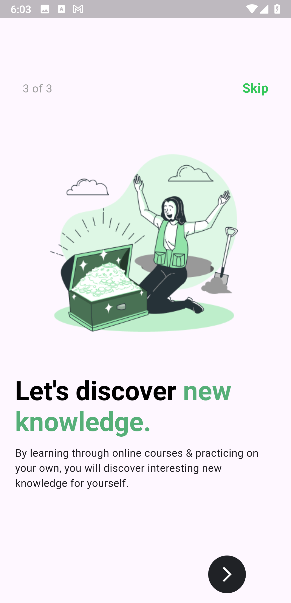
  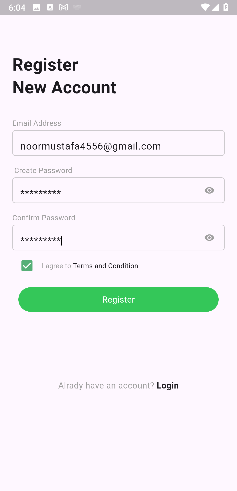
  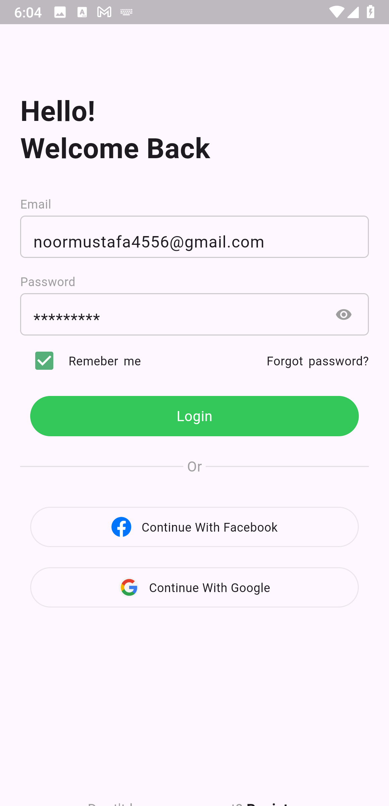
  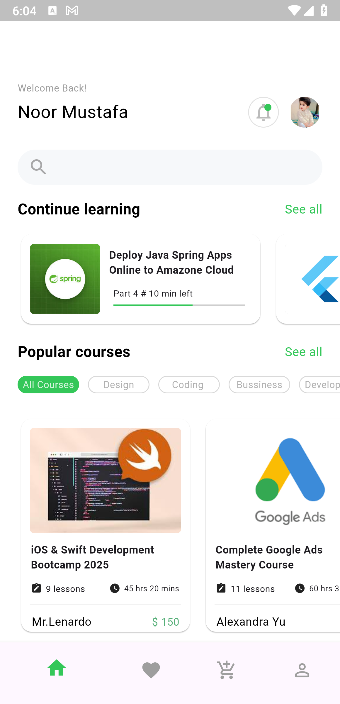
  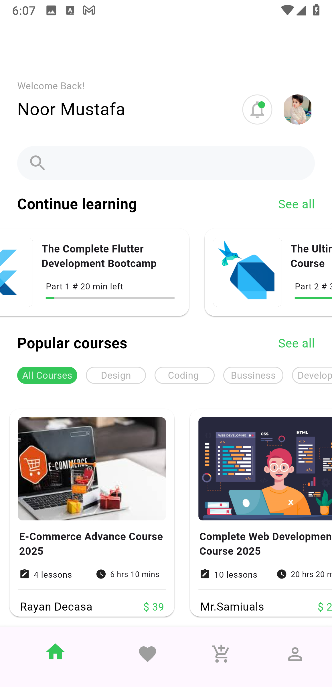
  
  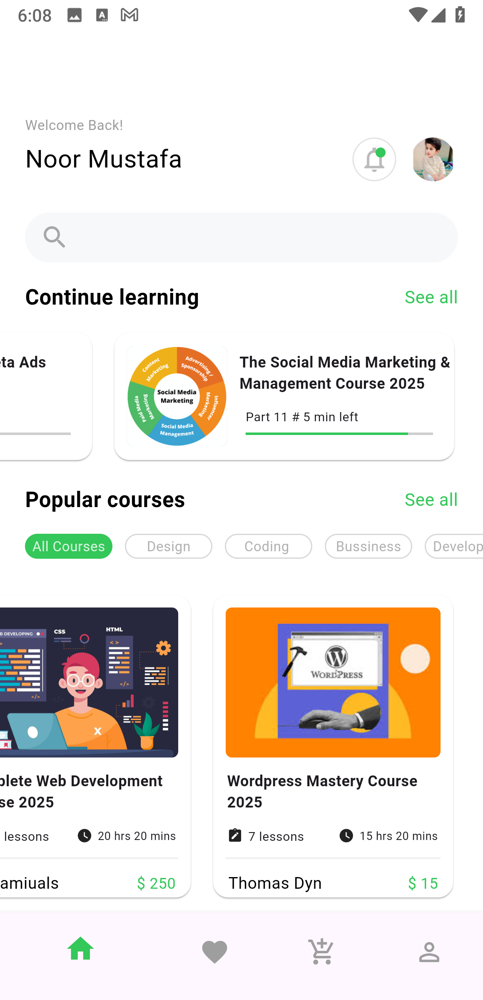
  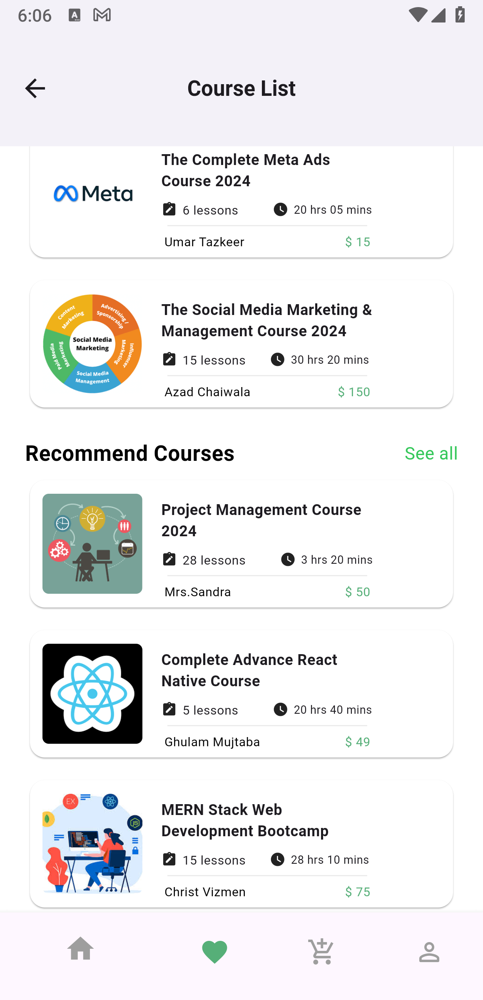
   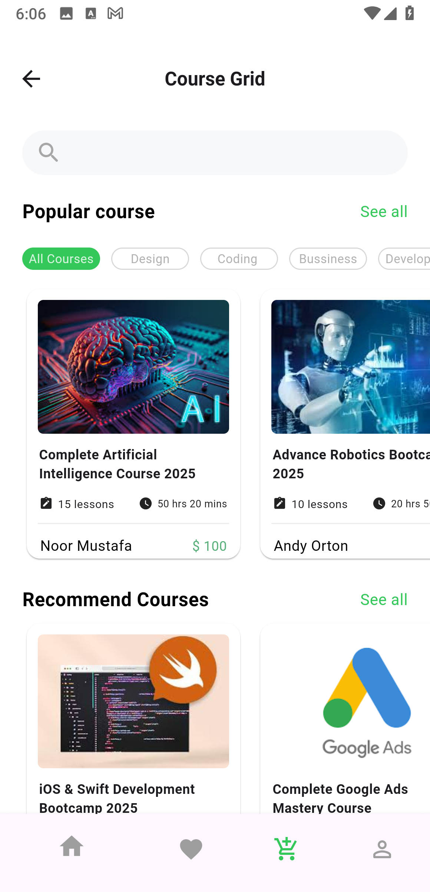
   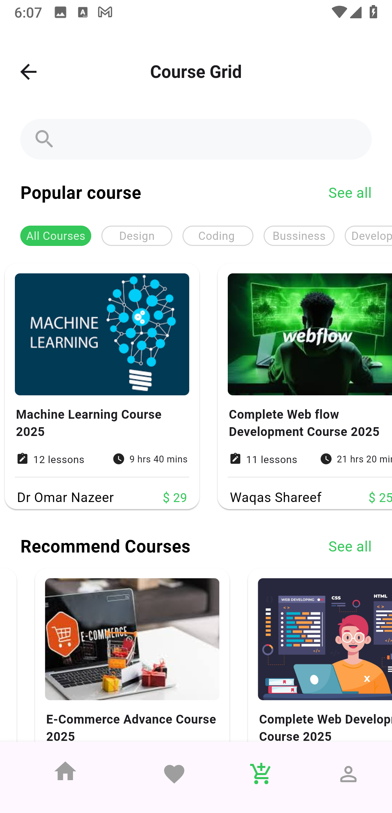
   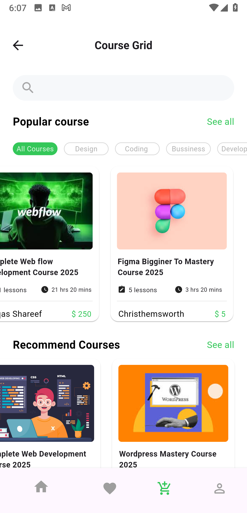
   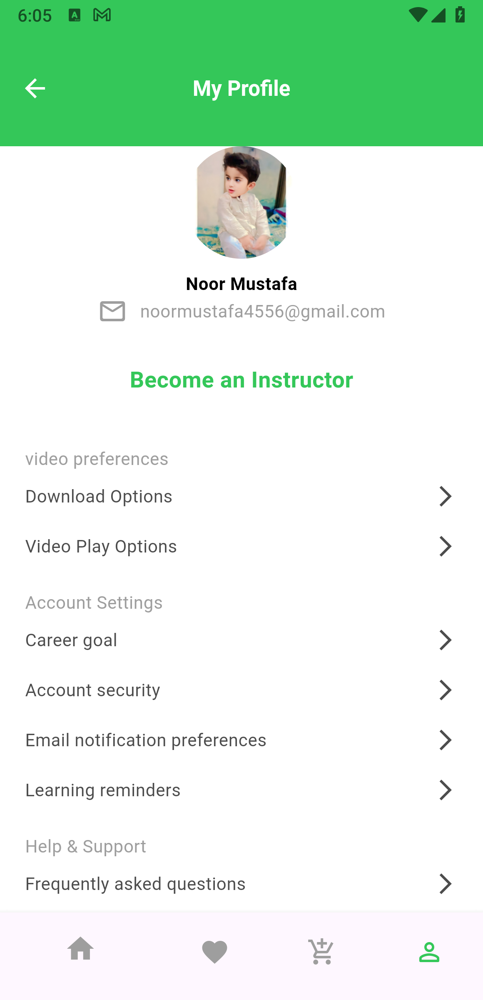
   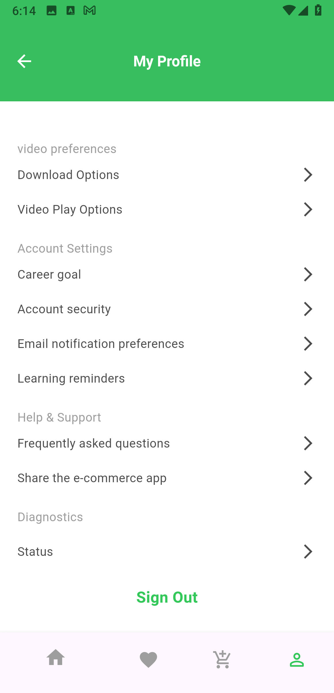

---

## 🛠 Tech Stack & Architecture

| Layer            | Technology                         |
|------------------|------------------------------------|
| **UI / Frontend** | Flutter & Dart                     |
| **State Management** | Provider / Riverpod / Bloc       |
| **Backend**       | Firebase Auth, Firestore / Custom REST API |
| **Offline Storage** | SQLite / Hive / Local caching    |
| **Architecture**  | Clean Architecture (Separation of UI-Logic-Data) |

---

## 📂 Project Structure (Example)

