# 📘 E-Course App (Flutter)

A dynamic and fully featured **Learning Management App** built with **Flutter & Dart**, designed for both learners and educators. This app allows instructors to create and manage courses, while students can enroll, view lessons (video/text), track progress, and participate in quizzes — all via a sleek mobile interface. Built with clean architecture, modern state management and offline-ready capabilities, it aims to bring high-quality education to mobile devices.

---

## ✨ Key Features

🎓 Role Based Access – Separate, optimized flows for Students and Instructors.

🗂 Course Creation & Management – Instructors can create, update, and organize courses, modules, videos, and learning resources.

🔍 Course Discovery – Explore and search courses by subject, category, or instructor, with smart filters.

📖 Lesson Viewer – Students can stream videos, read text/PDF lessons, and learn at their own pace.

📊 Progress Tracking – Interactive dashboards show completed lessons, quiz results, and certificate progress.

🧪 Quizzes & Assessments – Built-in module-wise quizzes to reinforce learning and evaluate understanding.

📜 Certificates – Auto-generated completion certificates after finishing a course.

📥 Offline Mode – Download lessons and access them without internet (in development).

🎨 Modern UI / Themes – Beautiful Material Design, dark & light modes, and smooth animations.

🔐 Secure Authentication – Email/password and social logins powered by Firebase Auth.

☁️ Backend Integration – Uses Firebase Firestore & Storage (or custom API) for secure data handling.

🎬 Multimedia Support – Supports video streaming, PDF viewing, and interactive quizzes.

📱 Responsive & Cross-Platform – Built with Flutter, offering a consistent experience on Android and iOS.
---

## 🖼 Screenshots

<p align="center">
  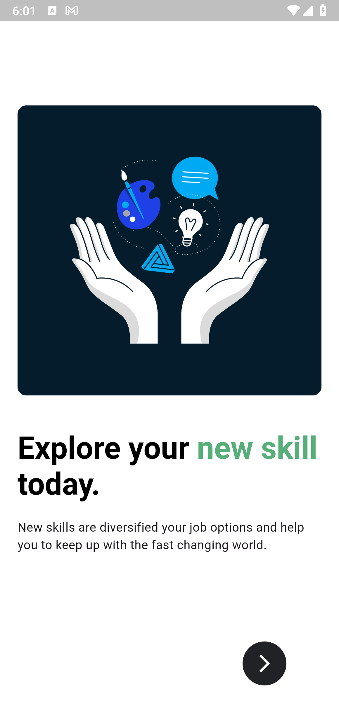
  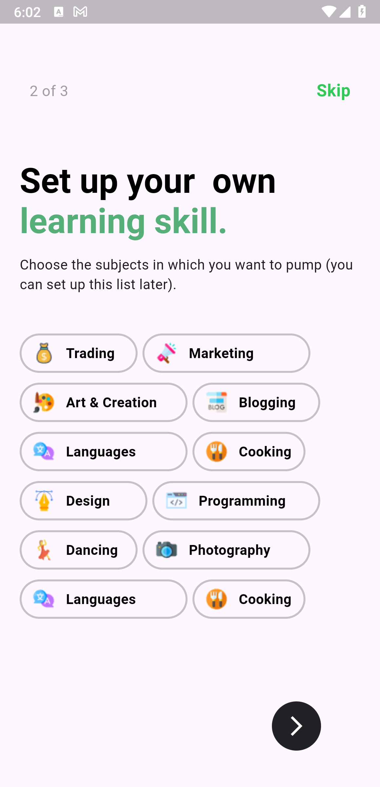
  
  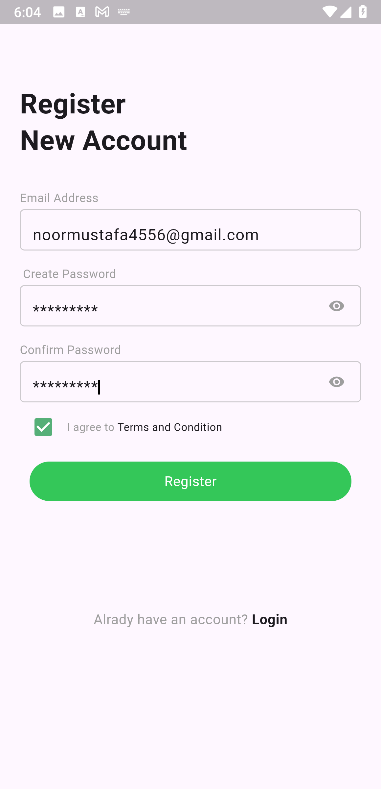
  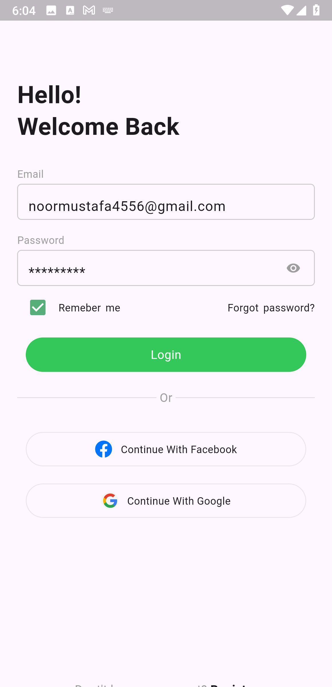
  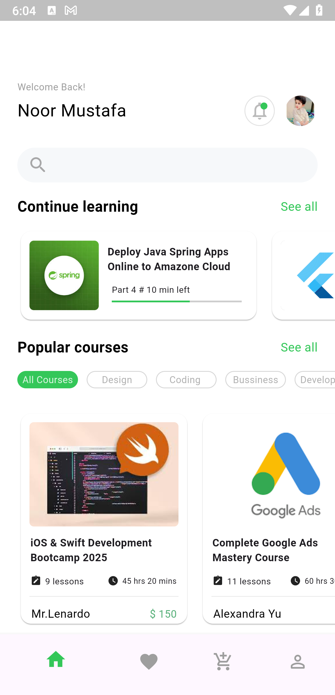
  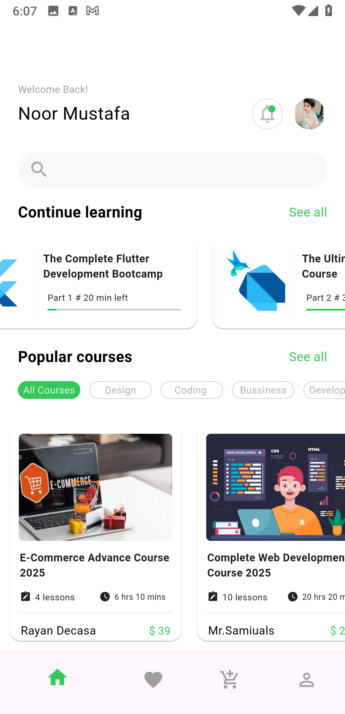
  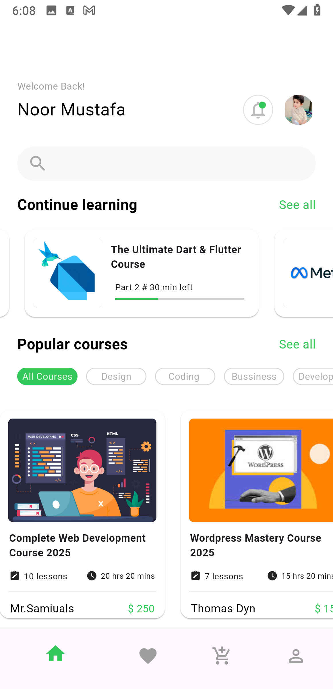
  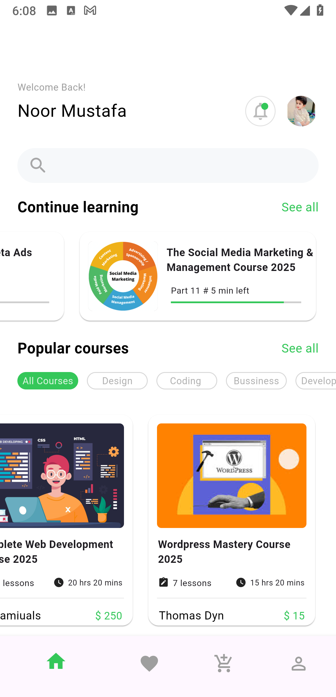
  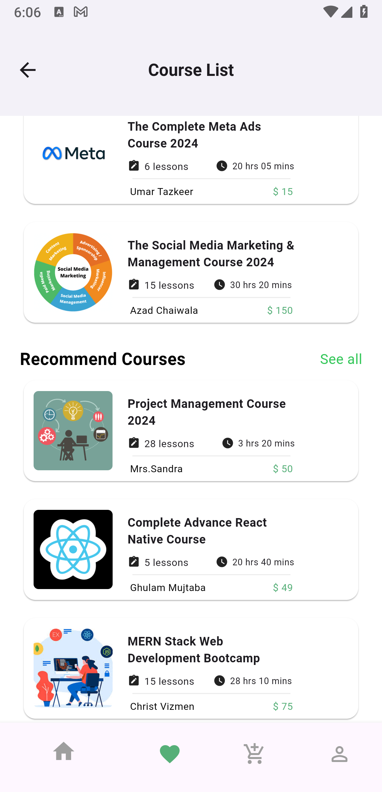
   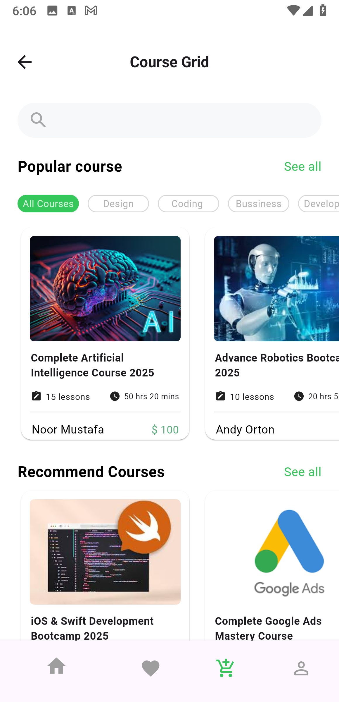
   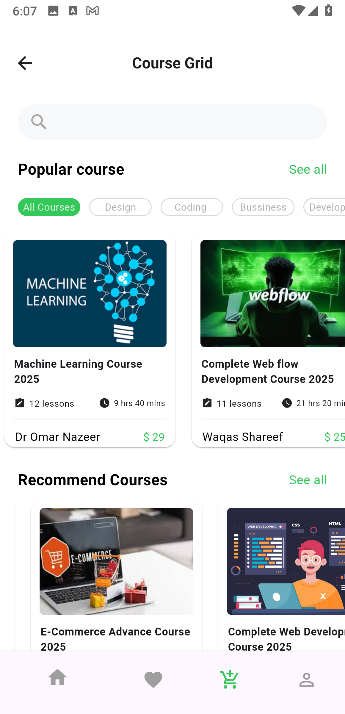
   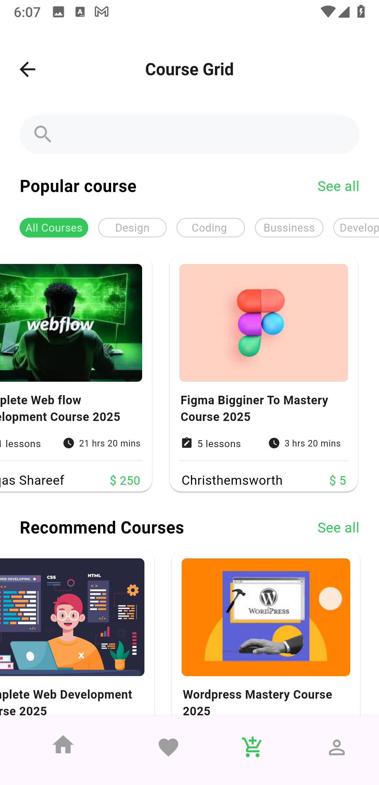
   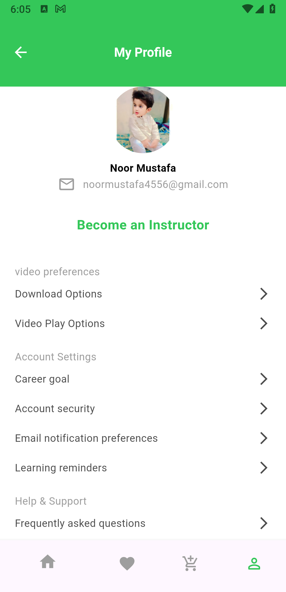
   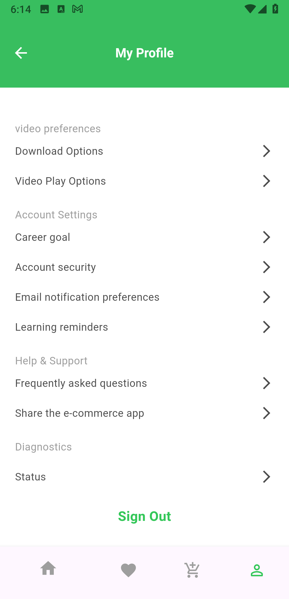
</p>

---

## 🛠 Tech Stack & Architecture

| Layer            | Technology                         |
|------------------|------------------------------------|
| **UI / Frontend** | Flutter & Dart                     |
| **State Management** | Provider / Riverpod / Bloc       |
| **Backend**       | Firebase Auth, Firestore / Custom REST API |
| **Offline Storage** | SQLite / Hive / Local caching    |
| **Architecture**  | Clean Architecture (Separation of UI-Logic-Data) |

---

## 📂 Project Structure 
```bash
E-Coure-App-Flutter/
├── android/          # Android-specific files
├── ios/              # iOS-specific files
├── lib/              # Main Dart source code
│   ├── main.dart     # Entry point
│   ├── screens/      # UI screens (e.g., home, login)
│   ├── widgets/      # Reusable components
│   ├── models/       # Data models (e.g., Course, User)
│   ├── services/     # Business logic (e.g., API calls)
│   └── utils/        # Helpers (e.g., constants, validators)
├── assets/           # Images, fonts, etc.
├── test/             # Unit and widget tests
├── pubspec.yaml      # Dependencies and config
└── README.md         # This file!
```
## 🚀 Getting Started

To get a local copy up and running, follow these simple steps.

### Prerequisites

-   Flutter SDK installed on your machine.
-   An IDE like Android Studio or VS Code with Flutter plugins.

---

### Installation

1.  **Clone the repository:**
    ```bash
    git clone https://github.com/NoorMustafa4556/E-Coure-App-Flutter.git
    ```
2.  **Navigate to the project directory:**
    ```bash
    cd E-Coure-App-Flutter
    ```
3.  **Install dependencies:**
    ```bash
    flutter pub get
    ```
4.  **Run the app on an emulator or a physical device:**
    ```bash
    flutter run
    ```
Select your emulator/simulator or connect a physical device.

---
   # 👋🏻 Hi, I'm Noor Mustafa

A passionate and results-driven **Flutter Developer** from **Bahawalpur, Pakistan**, specializing in building elegant, scalable, and high-performance cross-platform mobile applications using **Flutter** and **Dart**.

With a strong understanding of **UI/UX principles**, **state management**, and **API integration**, I aim to deliver apps that are not only functional but also user-centric and visually compelling. My development approach emphasizes clean code, reusability, and performance.

---

## 🚀 What I Do

- 🧑🏻💻 **Flutter App Development** – I build cross-platform apps for Android, iOS, and the web using Flutter.
- 🔗 **API Integration** – I connect apps to powerful RESTful APIs and third-party services.
- 🎨 **UI/UX Design** – I craft responsive and animated interfaces that elevate the user experience.
- 🔐 **Authentication & Firebase** – I implement secure login systems and integrate Firebase services.
- ⚙️ **State Management** – I use Provider, setState, and Riverpod (in-progress) for scalable app architecture.
- 🧠 **Clean Architecture** – I follow MVVM and MVC patterns for maintainable code.

---


## 🌟 Projects I'm Proud Of

- 🌤️ **[Live Weather Check App](https://github.com/NoorMustafa4556/Live-Weather-Check-App)** – Real-time weather forecast using OpenWeatherMap API  
- 🤖 **[AI Chatbot (Gemini)](https://github.com/NoorMustafa4556/Ai-ChatBot)** – Conversational AI chatbot powered by Google’s Gemini  

- 🍔 **[Recipe App](https://github.com/NoorMustafa4556/Recipe-App)** – Discover recipes with images, categories, and step-by-step instructions  

- 📚 **[Palindrome Checker](https://github.com/NoorMustafa4556/Palindrome-Checker-App)** – A Theory of Automata-based project to identify palindromic strings  

> 🎯 Check out all my repositories on [github.com/NoorMustafa4556](https://github.com/NoorMustafa4556?tab=repositories)

---

## 🛠️ Tech Stack & Tools

| Area                | Tools/Technologies |
|---------------------|--------------------|
| **Languages**       | Dart, JavaScript, Python (basic) |
| **Mobile Framework**| Flutter            |
| **Backend/Cloud**   | Firebase (Auth, Realtime DB, Storage), Django, Flask |
| **Frontend (Web)**  | React.js (basic), HTML, CSS, Bootstrap |
| **State Management**| Provider, setState, Riverpod (learning) |
| **API & Storage**   | REST APIs, HTTP, Shared Preferences, SQLite |
| **Design**          | Material, Cupertino, Lottie Animations, Gradient UI |
| **Version Control** | Git, GitHub        |
| **Tools**           | Android Studio, VS Code, Postman, Figma (basic) |

---

## 🧰 Tech Toolbox

<p align="left">
  
  
  
  
  
  
  
  
</p>

---

## 📈 Current Focus

- 💡 Enhancing Flutter animations and transitions
- 🤖 Implementing AI-based logic with Google Gemini API
- 📲 Building portfolio-level applications using full-stack Django & Flutter

---

## 📫 Let's Connect!

<p align="left">
  <a href="https://x.com/NoorMustafa4556" target="blank">
    
  </a>
  <a href="https://www.linkedin.com/in/noormustafa4556/" target="blank">
    
  </a>
  <a href="https://www.facebook.com/NoorMustafa4556" target="blank">
    
  </a>
  <a href="https://instagram.com/noormustafa4556" target="blank">
    
  </a>
  <a href="https://wa.me/923087655076" target="blank">
    
  </a>
  <a href="https://www.tiktok.com/@noormustafa4556" target="blank">
    
  </a>
</p>

- 📍 **Location:** Bahawalpur, Punjab, Pakistan

---

> _“Learning never stops. Every app I build makes me a better developer — one widget at a time.”_

---

