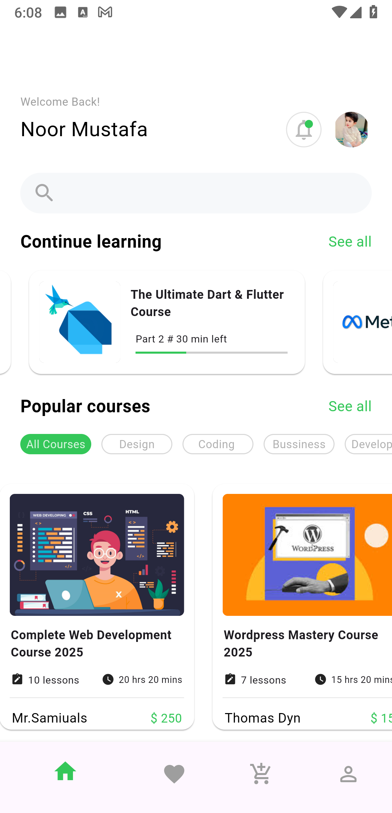

# 📘 E-Course App (Flutter)

A dynamic and fully featured **Learning Management App** built with **Flutter & Dart**, designed for both learners and educators. This app allows instructors to create and manage courses, while students can enroll, view lessons (video/text), track progress, and participate in quizzes — all via a sleek mobile interface. Built with clean architecture, modern state management and offline-ready capabilities, it aims to bring high-quality education to mobile devices.

---

## ✨ Key Features

🎓 Role Based Access – Separate, optimized flows for Students and Instructors.

🗂 Course Creation & Management – Instructors can create, update, and organize courses, modules, videos, and learning resources.

🔍 Course Discovery – Explore and search courses by subject, category, or instructor, with smart filters.

📖 Lesson Viewer – Students can stream videos, read text/PDF lessons, and learn at their own pace.

📊 Progress Tracking – Interactive dashboards show completed lessons, quiz results, and certificate progress.

🧪 Quizzes & Assessments – Built-in module-wise quizzes to reinforce learning and evaluate understanding.

📜 Certificates – Auto-generated completion certificates after finishing a course.

📥 Offline Mode – Download lessons and access them without internet (in development).

🎨 Modern UI / Themes – Beautiful Material Design, dark & light modes, and smooth animations.

🔐 Secure Authentication – Email/password and social logins powered by Firebase Auth.

☁️ Backend Integration – Uses Firebase Firestore & Storage (or custom API) for secure data handling.

🎬 Multimedia Support – Supports video streaming, PDF viewing, and interactive quizzes.

📱 Responsive & Cross-Platform – Built with Flutter, offering a consistent experience on Android and iOS.
---

## 🖼 Screenshots

  
  
  
  
  
  
  
  
  
  
   
   
   
   
   

---

## 🛠 Tech Stack & Architecture

| Layer            | Technology                         |
|------------------|------------------------------------|
| **UI / Frontend** | Flutter & Dart                     |
| **State Management** | Provider / Riverpod / Bloc       |
| **Backend**       | Firebase Auth, Firestore / Custom REST API |
| **Offline Storage** | SQLite / Hive / Local caching    |
| **Architecture**  | Clean Architecture (Separation of UI-Logic-Data) |

---

## 📂 Project Structure (Example)

